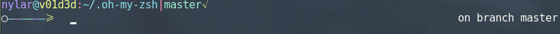

# dotz
some custom dotfiles

The small but cool bunny fetch script, I put an elegant python quine in there (self replicating code) but it only works in a python script.  Calling it from a file is cheating!

 

This is the new1 theme

